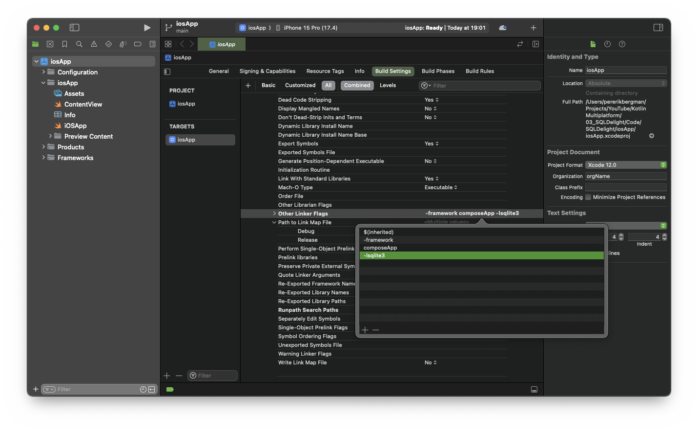

## SQLDelight Overview

SQLDelight is a Kotlin multiplatform library that allows you to write SQL queries and then generates type-safe Kotlin
code from those queries. It supports Android, iOS, JavaScript, and desktop platforms, making it an ideal choice for
cross-platform application development. By providing a robust abstraction over SQL, SQLDelight simplifies database
management and integrates smoothly with Kotlin coroutines and Flow.

## Key Features

- **Multiplatform Support**: Works with Android, iOS, and desktop applications.
- **Type Safety**: Generates Kotlin APIs from SQL queries, ensuring compile-time verification.
- **Observability**: Easily observe changes in your database with Kotlin Flow.
- **Performance**: Executes queries efficiently with minimal overhead.

## Installation

### Update the version catalog

File: `gradle/libs.versions.toml`

```
[versions]

...

# Android
startupRuntime = "1.1.1"

# MOKO MVVM
mvvmCompose = "0.16.1"

# SQLDelight Dependencies
sqldelight = "2.0.2"
coroutinesExtensions = "2.0.2"
statelyCommon = "2.0.5"

[libraries]

...

# Android
androidx-startup-runtime = { module = "androidx.startup:startup-runtime", version.ref = "startupRuntime" }

# MOKO MVVM
mvvm-compose = { module = "dev.icerock.moko:mvvm-compose", version.ref = "mvvmCompose" }

# SQLDelight
android-driver = { module = "app.cash.sqldelight:android-driver", version.ref = "sqldelight" }
sqldelight-native-driver = { module = "app.cash.sqldelight:native-driver", version.ref = "sqldelight" }
sqldelight-sqlite-driver = { module = "app.cash.sqldelight:sqlite-driver", version.ref = "sqldelight" }
coroutines-extensions = { module = "app.cash.sqldelight:coroutines-extensions", version.ref = "coroutinesExtensions" }
stately-common = { module = "co.touchlab:stately-common", version.ref = "statelyCommon" } # (needed by SQLDeligt)
```

### Update dependency

File: `composeApp/build.gradle.kts`

Add the SQLDelight Gradle plugin to your project's build file:

```kotlin
plugins {
    id("app.cash.sqldelight") version libs.versions.sqldelight
}
```

```kotlin
kotlin {
    ...

    sourceSets {
        val desktopMain by getting

        androidMain.dependencies {
            ...

            // AndroidX
            implementation(libs.androidx.startup.runtime)

            // SQLDelight
            implementation(libs.android.driver)
        }

        commonMain.dependencies {
            ...

            // SQLDelight
            implementation(libs.coroutines.extensions)
            implementation(libs.stately.common) // Needed by SQLDelight
        }
        iosMain.dependencies {
            // SQLDelight
            implementation(libs.sqldelight.native.driver)
        }
        desktopMain.dependencies {
            ...

            // SQLDelight
            implementation(libs.sqldelight.sqlite.driver)
        }
    }
}
```

Configure SQLDelight for your specific targets (Android, iOS, etc.) in the same build file:

```kotlin
sqldelight {
    databases {
        create("Database") {
            packageName.set("com.rakangsoftware.sqldelight.data.local.database")
        }
    }
}
```

### Update xcode project

Add to `Other Linker Flags` with -lsqlite3



## SQLDelight Source

Adding the SQLDelight source folder `composeApp/src/commonMain/sqldelight` is called adding a SQLDelight source folder.

Create a database.sq file in the same package as you set the package name to be in the sqldelight block.

`/com/rakangsoftware/sqldelight/data/local/database/databas.sq`

```
-- Schema Definitions
-- -------------------

PRAGMA user_version = 1;

-- Create Post Table
CREATE TABLE PostDto (
  id INTEGER PRIMARY KEY AUTOINCREMENT,
  name TEXT NOT NULL,
  title TEXT NOT NULL,
  body TEXT NOT NULL,
  creationDate TEXT DEFAULT (datetime('now')) NOT NULL,
  modifiedDate TEXT DEFAULT (datetime('now')) NOT NULL
);

-- Named Queries for Post Table

selectLastInsertedRowId:
SELECT last_insert_rowid();

selectAllPosts:
SELECT * FROM PostDto;

selectPostById:
SELECT * FROM PostDto WHERE id = :id;

insertPost:
INSERT INTO PostDto (name, title, body) VALUES (:name, :title, :body);

updatePost:
UPDATE PostDto SET name = :name, title = :title, body = :body, modifiedDate = datetime('now') WHERE id = :id;

deletePost:
DELETE FROM PostDto WHERE id = :id;
```

## Prepopulate

File: `composeApp/src/commonMain/sqldelight/com/rakangsoftware/sqldelight/data/local/database/prepopulate.sq`

```
-- Prepopulate
INSERT INTO PostDto (name, title, body) VALUES ("Julia", 'Discovering Space', 'The cosmos is vast and beautiful.');
INSERT INTO PostDto (name, title, body) VALUES ("Marco", 'Java vs Python', 'Comparing two powerful languages.');
INSERT INTO PostDto (name, title, body) VALUES ("Emily", 'Gardening Tips', 'Learn to grow your own herbs.');
INSERT INTO PostDto (name, title, body) VALUES ("Raj", 'Mysteries of History', 'Exploring ancient civilizations.');
INSERT INTO PostDto (name, title, body) VALUES ("Sarah", 'Healthy Eating', 'Balanced diets for a busy life.');
INSERT INTO PostDto (name, title, body) VALUES ("Alex", 'Marathon Training', 'Preparing for your first race.');
INSERT INTO PostDto (name, title, body) VALUES ("Lena", 'Photography Basics', 'Capture stunning landscapes.');
INSERT INTO PostDto (name, title, body) VALUES ("Tom", 'Future of AI', 'How AI is changing our world.');
INSERT INTO PostDto (name, title, body) VALUES ("Sophia", 'World Cuisine', 'Exploring flavors from around the globe.');
INSERT INTO PostDto (name, title, body) VALUES ("Miguel", 'Space Exploration', 'Journey to the stars and beyond.');
```

Run `./gradlew generateSqlDelightInterface`

## DriverFactory

### Common Main

File: `composeApp/src/commonMain/kotlin/core/database/DriverFactory.kt`

```kotlin
val DB_NAME = "sqldemo.db"

expect class DriverFactory() {
    fun createDriver(): SqlDriver
}

fun createDatabase(driverFactory: DriverFactory): Database {
    return Database(driverFactory.createDriver())
}
```

### iOS

File: `composeApp/src/iosMain/kotlin/core/database/DriverFactory.ios.kt`

```kotlin
actual class DriverFactory {
    actual fun createDriver(): SqlDriver {
        return NativeSqliteDriver(Database.Schema, DB_NAME)
    }
}
```

### Android

File: `composeApp/src/androidMain/kotlin/core/initializer/AppContextWrapper.kt`

```kotlin
object AppContextWrapper {
    var appContext: Context? = null
}

// Used in the Android Manifest
internal class ContextInitializer : Initializer<Context> {
    private var appContext: Context? = null

    override fun create(context: Context): Context =
        context.applicationContext.also {
            appContext = it
            AppContextWrapper.appContext = it
        }

    override fun dependencies(): List<Class<out Initializer<*>>> = emptyList()
}
```

File: `composeApp/src/androidMain/AndroidManifest.xml`

```
<manifest xmlns:android="http://schemas.android.com/apk/res/android" xmlns:tools="http://schemas.android.com/tools">

  <application>

    <provider
      android:name="androidx.startup.InitializationProvider"
      android:authorities="${applicationId}.androidx-startup"
      android:exported="false"
      tools:node="merge">
      <meta-data
        android:name="core.initializer.ContextInitializer"
        android:value="androidx.startup"/>
    </provider>

    ...

  </application>

</manifest>

```

File: `composeApp/src/androidMain/kotlin/core/database/DriverFactory.android.kt`

```kotlin
actual class DriverFactory actual constructor() {
    actual fun createDriver(): SqlDriver {
        val appContext = AppContextWrapper.appContext!!
        return AndroidSqliteDriver(Database.Schema, appContext, DB_NAME)
    }
}
```

### Desktop

File: `composeApp/src/desktopMain/kotlin/core/database/DriverFactory.desktop.kt`

```kotlin
actual class DriverFactory {
    actual fun createDriver(): SqlDriver {
        // val driver: SqlDriver = JdbcSqliteDriver(JdbcSqliteDriver.IN_MEMORY)

        val dbFilePath = getPath(isDebug = false)
        val driver: SqlDriver = JdbcSqliteDriver("jdbc:sqlite:${dbFilePath}")

        // check if database alread created or not
        if (!File(dbFilePath).exists()) {
            Database.Schema.create(driver)
        }

        // Check if a migration is necessary
        val currentVersion = getSQLiteSchemaVersion(dbFilePath)
        val latestVersion = Database.Schema.version
        if (currentVersion < latestVersion) {
            Database.Schema.migrate(driver, currentVersion, latestVersion)
        }

        return driver
    }

    private fun getSQLiteSchemaVersion(dbPath: String): Long {
        val connection = DriverManager.getConnection("jdbc:sqlite:$dbPath")
        try {
            val statement = connection.createStatement() // pragma schema_version
            val resultSet = statement.executeQuery("PRAGMA user_version;")
            if (resultSet.next()) {
                return resultSet.getLong(1) // The schema version is in the first column.
            }
        } catch (e: Exception) {
            e.printStackTrace()
        } finally {
            connection.close()
        }
        return 0 // Default to 0 if version cannot be retrieved.
    }

    private fun getPath(isDebug: Boolean = false): String {
        val propertyKey = if (isDebug) "java.io.tmpdir" else "user.home"
        val parentFolder = File(System.getProperty(propertyKey) + "/SQLDelightDemoApp")
        if (!parentFolder.exists()) {
            parentFolder.mkdirs()
        }
        val databasePath = File(System.getProperty(propertyKey) + "/SQLDelightDemoApp", DB_NAME)
        return databasePath.absolutePath
    }
}
```

## DataSource

### Interface

File: `composeApp/src/commonMain/kotlin/post/data/post/PostDataSource.kt`

```kotlin
interface PostDataSource {
    fun getAll(): Flow<List<PostDto>>
    fun getById(id: Long): Flow<PostDto>
    fun put(postDto: PostDto): Flow<PostDto>
    fun update(postDto: PostDto): Flow<PostDto>
    fun delete(postDto: PostDto): Flow<Unit>
}
```

### Implementation

File: `composeApp/src/commonMain/kotlin/post/data/post/PostDataSourceSql.kt`

```kotlin
class PostDataSourceSql(database: Database) : PostDataSource {

    private val query = database.databasQueries

    override fun getAll() =
        query.selectAllPosts()
            .asFlow()
            .mapToList(Dispatchers.IO)

    override fun getById(id: Long) =
        query.selectPostById(id)
            .asFlow()
            .mapToOne(Dispatchers.IO)

    override fun put(postDto: PostDto) = run {
        query.insertPost(postDto.name, postDto.title, postDto.body)
        val id = query.seletcLastInsertedRowId().executeAsOne()
        getById(id)
    }

    override fun update(postDto: PostDto) = run {
        query.updatePost(postDto.name, postDto.title, postDto.body, postDto.id)
        getById(postDto.id)
    }

    override fun delete(postDto: PostDto) = flow {
        query.deletePost(postDto.id)
        emit(Unit)
    }

}
```

## More Resources

- **GitHub Repository**: [SQLDelight on GitHub](https://github.com/cashapp/sqldelight)
- **Official Documentation**: [SQLDelight Documentation](https://cashapp.github.io/sqldelight/2.0.1/)

Feel free to contribute or suggest improvements through GitHub issues or pull requests. Enjoy building with SQLDelight!